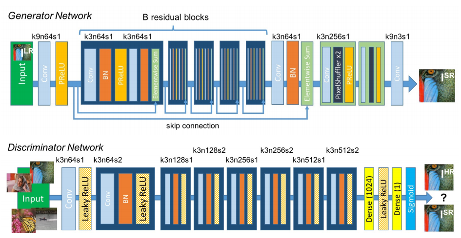
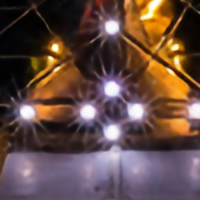
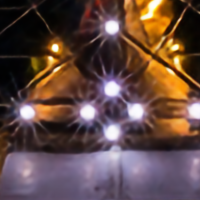
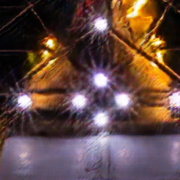
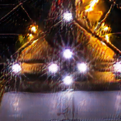

# SRGAN_tensorflow2
An implementation of SRGAN using Tensorflow2.0

<center></center>

---  

## Requirements
- tensorflow 2.0
- python 3
- numpy
- pillow
- matplotlib
- glob

---

## Model
### SRGAN

<center></center>

### Training Guide

* (In paper) For each mini-batch we **crop 16 random 96 × 96 HR sub images** of distinct training images. Note that we can apply the generator model to images of arbitrary size as it is fully convolutional. We scaled the range of the **LR input images to [0, 1]** and for the **HR images to [−1, 1]**. The MSE loss was thus calculated on images of intensity range [−1, 1]. VGG feature maps were also rescaled by a factor of 1/12.75 to obtain VGG losses of a scale that is comparable to the MSE loss. This is equivalent to multiplying Equation(5) with a rescaling factor of ≈ 0.006. For optimization we use Adam [36] with β1 = 0.9. The SRResNet networks were trained with a learning rate of 10^−4 and 10^6 update iterations. **We employed the trained MSE-based SRResNet network as initialization for the generator when training the actual GAN to avoid undesired local optima.** All SRGAN variants were trained with 10^5 update iterations at a learning rate of 10^−4 and another 10^5 iterations at a lower rate of 10^−5.


---

## Documentation
### Download Dataset
* DIV2K dataset can download ----> https://data.vision.ee.ethz.ch/cvl/DIV2K/
* I use [DIV2K/DIV2K_train_HR](http://data.vision.ee.ethz.ch/cvl/DIV2K/DIV2K_train_HR.zip) & [DIV2K/DIV2K_train_LR_unknown/X4](http://data.vision.ee.ethz.ch/cvl/DIV2K/DIV2K_train_LR_unknown_X4.zip) for train
```
SRGAN_tensorflow2
└── dataset
   └── DIV2K_train_HR
       ├── 001.png 
       ├── 002.png
       └── ...
   └── DIV2K_train_LR_unknown
      └── X4
          ├── 001.png 
          ├── 002.png
          └── ...

```

### Training GAN
* First, You have to run `train_SRResNet.py` to avoid undesired local optima of GAN.
* After that, Run `train_SRGAN.py`
---

## Results
### SRResNet (Total 1,000,000 iteration)
|iter|200K|400K|600K|800K|1M|
|------|---|---|---|---|---|
|Image||||||

### SRGAN (Total 200K iteration)
|iter|40K|80K|120K|160K|200K|
|------|---|---|---|---|---|
|Image||||||

---

## Reference
 [Christian Ledig. *Photo-Realistic Single Image Super-Resolution Using a Generative Adversarial Network*, CVPR2017.](https://arxiv.org/pdf/1609.04802.pdf)